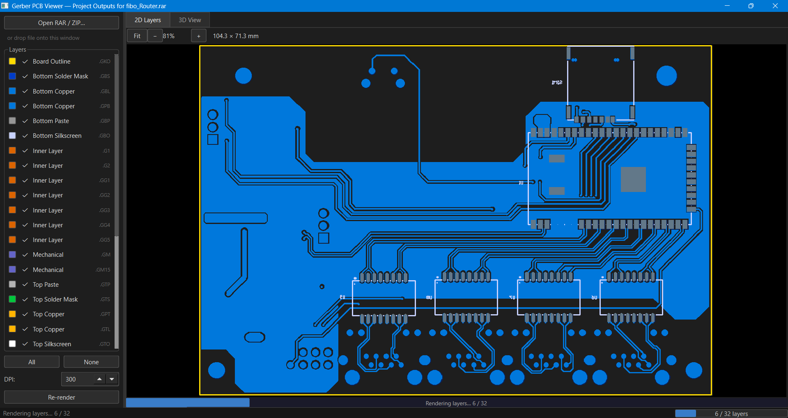
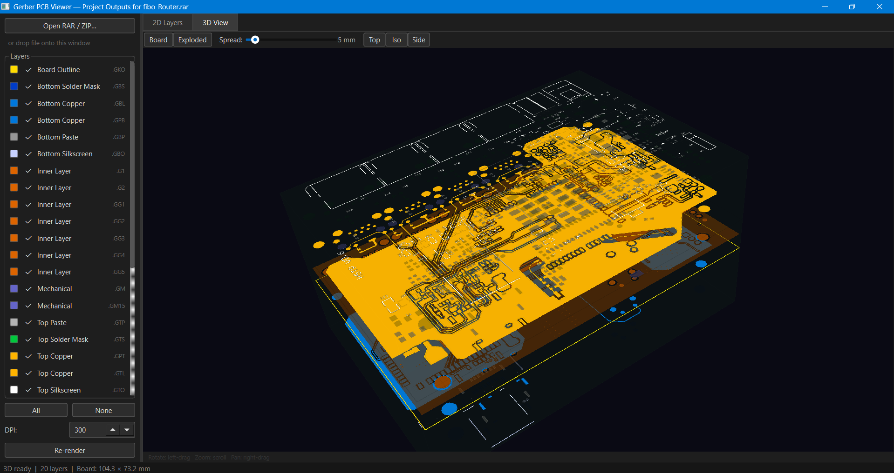

# Exploded Gerber Viewer

A local PCB Gerber file viewer built with Python. Load any RAR or ZIP archive of Gerber files and inspect the board in a 2D layer view or an interactive 3D exploded view.

---

## Screenshots

**2D Layer View**


**3D Exploded View**


---

## Features

- **Drag and drop** a RAR / ZIP archive to load a PCB project — no manual extraction needed
- **2D layer viewer** — all layers composited in the correct PCB stack order with zoom and pan
- **Per-layer toggle** — show or hide individual layers in real time in both 2D and 3D
- **3D Board mode** — realistic PCB with green FR4 substrate and composited top / bottom copper, silk and mask textures
- **3D Exploded mode** — one transparent plane per layer type, separated by an adjustable spread distance so you can see the full layer stack
- **Spread slider** — collapse or explode the layer stack from 0 to 60 mm
- **Camera presets** — Top, Isometric and Side view buttons
- **Progress bars** — inside each tab and in the status bar during rendering
- **DPI control** — 72 – 1200 DPI re-render for quality vs speed trade-off
- Supports Altium Designer Gerber output (RS-274X) and standard Gerber packages

---

## Requirements

- Windows 10 / 11
- Python 3.10+
- [7-Zip](https://www.7-zip.org/) installed at `C:\Program Files\7-Zip\7z.exe` (used for RAR extraction)
- A GPU that supports OpenGL (for the 3D view)

---

## Installation

```bash
# Clone the repository
git clone https://github.com/kullu1991/exploded_gerber_viewer.git
cd exploded_gerber_viewer

# Create a virtual environment and install dependencies
py -m venv .venv
.venv\Scripts\pip install -r requirements.txt
```

---

## Running

**Double-click** `launch.bat`

or from the terminal:

```bash
.venv\Scripts\python main.py
```

---

## Usage

1. Launch the app
2. Drop a `.rar` or `.zip` Gerber archive onto the window (or click **Open RAR / ZIP…**)
3. The 2D view renders all layers automatically — use the layer panel on the left to toggle visibility
4. Switch to the **3D View** tab to build the 3D model
   - Use **Board** mode for a realistic PCB appearance
   - Use **Exploded** mode to see individual layer types spread apart
   - Drag the **Spread** slider to control layer separation
   - Rotate with left-drag, zoom with scroll, pan with right-drag

---

## Project Structure

```
exploded_gerber_viewer/
├── main.py               # Entry point
├── launch.bat            # Double-click launcher (Windows)
├── requirements.txt
├── images/
│   ├── main_screen.png
│   └── 3d_view.png
└── app/
    ├── layer_config.py   # Layer type definitions, colors, extension map
    ├── extractor.py      # RAR / ZIP extraction via 7-Zip
    ├── renderer.py       # Gerber → PIL images, global-bbox compositing
    ├── view_2d.py        # 2D QGraphicsView with zoom / pan
    ├── view_3d.py        # 3D viewer (pyvistaqt) — Board and Exploded modes
    └── window.py         # Main window, background render workers, layer panel
```

---

## Dependencies

| Package | Purpose |
|---------|---------|
| `PyQt6` | GUI framework |
| `pygerber` | Gerber RS-274X parsing and rasterization |
| `Pillow` | Image compositing |
| `numpy` | Array math |
| `pyvista` | 3D mesh and rendering |
| `pyvistaqt` | Embeds pyvista in a Qt widget |
| `qtpy` | Qt version abstraction for pyvistaqt |

---

## Supported Gerber Extensions

| Extension | Layer |
|-----------|-------|
| `.GTL` | Top copper |
| `.GBL` | Bottom copper |
| `.G1`, `.G2` | Inner copper layers |
| `.GTO` / `.GBO` | Top / Bottom silkscreen |
| `.GTS` / `.GBS` | Top / Bottom solder mask |
| `.GTP` / `.GBP` | Top / Bottom paste |
| `.GKO` | Board outline |
| `.GM`, `.GM15` | Mechanical layers |
| `.DRL`, `.TXT` | Drill files (listed, not rendered) |

---

## License

MIT
